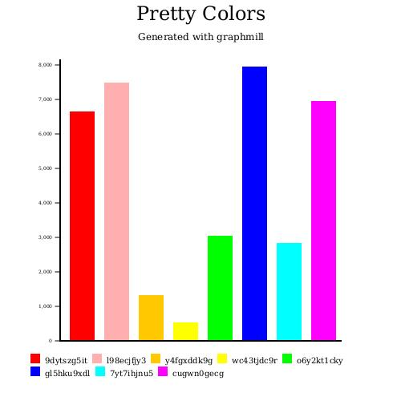
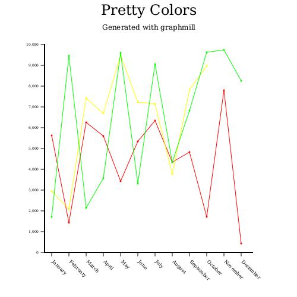
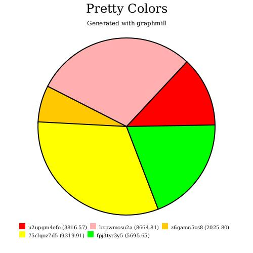
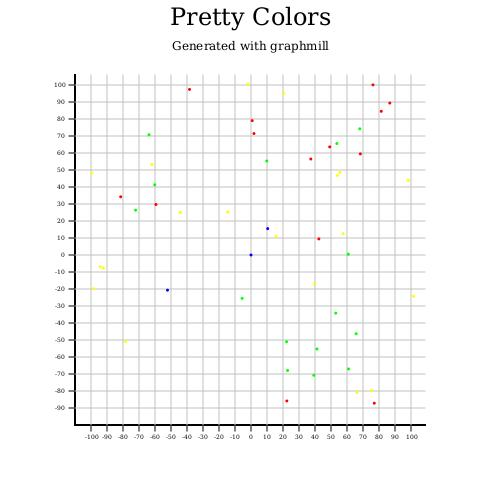

# Graphmill

An experimental & simple charting library that creates 2d charts using Kotlin without any 3rd party OpenSource Java libraries like JFreeChart

## Chart functionality available:

- BarChart2d
- LineChart2d
- PieChart2d
- ScatterChart2d (WIP)
- NetworkChart2d (Not Started)

## Examples:






## Build the Project

```shell
./gradlew clean build
```

## Format the Project with KtLint

```shell
./gradlew ktlintFormat
```